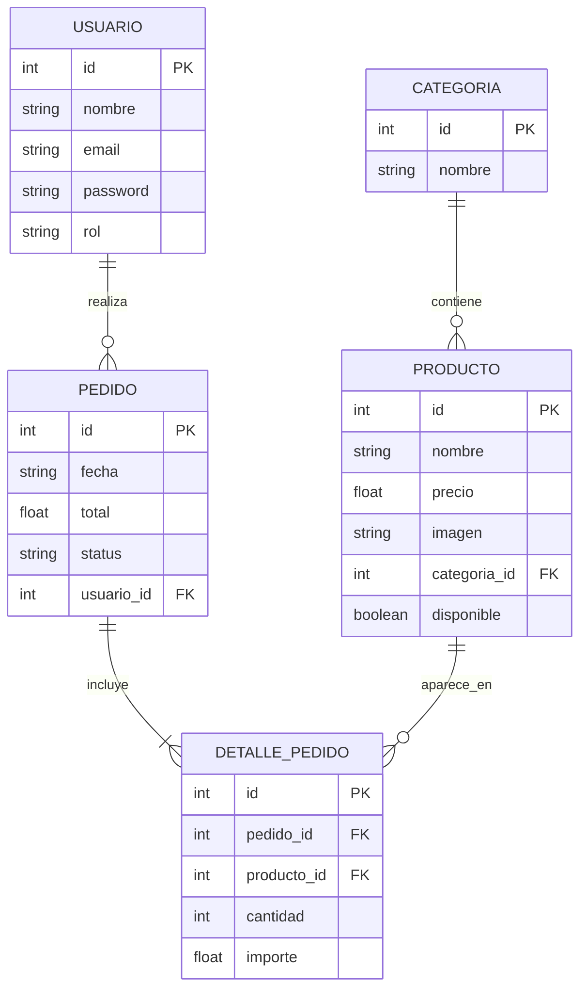
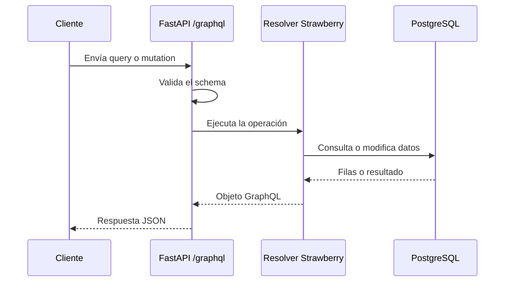

# Reporte de práctica — Programación Web 2

## Portada

| Campo | Dato |
|--|--|
| Darío Jiménez Guzmán | |
| Materia | Programación Web 2 |
| Práctica | P6 — Flujo E-Commerce Backend GraphQL |
| Fecha | 12/09/2026 |

## Marco teórico

### GraphQL

GraphQL es un lenguaje de consulta para APIs y también un runtime que ejecuta esas consultas contra un esquema tipado. A diferencia de una API REST, donde normalmente cada recurso tiene endpoints separados, GraphQL expone un punto de entrada y permite que el cliente solicite exactamente los campos que necesita. En este backend, FastAPI publica el endpoint `/graphql` y Strawberry convierte las clases de Python en un esquema GraphQL ejecutable.

El esquema funciona como un contrato entre el cliente y el servidor. Define qué tipos existen, qué campos tiene cada tipo, qué argumentos acepta una operación y qué datos puede devolver. Gracias a este contrato, GraphQL puede validar la consulta antes de ejecutarla y los clientes pueden conocer la API mediante introspección.

### Schema

El schema es la descripción formal de la API. En el proyecto se construye en `schema.py` mediante `strawberry.Schema`. El tipo raíz `Query` reúne las consultas de productos, categorías y pedidos, mientras que `Mutation` reúne las operaciones que modifican productos o crean pedidos. Las clases de los archivos `resolvers/` representan los tipos y operaciones del dominio.

Además de los tipos raíz, el esquema define tipos de objetos como `Producto`, `Categoria`, `Pedido`, `DetallePedido` y `Usuario`, así como tipos de entrada (`input`) para recibir datos estructurados. Los campos obligatorios se marcan con `!`; por ejemplo, `id: Int!` exige que el identificador siempre exista.

### Consultas vs. mutaciones

Las consultas (`Query`) sirven para leer información y no deberían producir cambios en la base de datos. Algunos ejemplos son `productos`, `producto`, `categorias`, `categoria` y `pedidos`. Pueden aceptar argumentos como `limite`, `desde` o `id` para filtrar y paginar los resultados.

Las mutaciones (`Mutation`) representan operaciones que cambian el estado del sistema. En esta práctica son `crearProducto`, `actualizarProducto`, `eliminarProducto` y `crearPedido`. Una mutación recibe los datos de entrada, ejecuta las operaciones necesarias en PostgreSQL y devuelve el objeto resultante o un valor booleano.

### Entrada

GraphQL utiliza tipos `input` para separar los datos que entran al servidor de los objetos que el servidor devuelve. `ProductoInput` recibe nombre, precio, imagen, categoría y disponibilidad. `PedidoInput` recibe una lista de `RenglonInput`, donde cada renglón indica el producto y la cantidad solicitada.

Esta separación facilita la validación del contrato y hace explícita la forma de cada operación. Por ejemplo, crear un pedido no recibe directamente un pedido completo con sus identificadores internos; recibe los renglones necesarios para que el resolver calcule el total y genere el pedido y sus detalles.

### Resolver

Un resolver es la función que sabe cómo obtener o modificar el valor de un campo GraphQL. En este backend, los resolvers son métodos asíncronos que usan el pool de `asyncpg` disponible en `info.context["pool"]`. Por ejemplo, el resolver de `productos` ejecuta una consulta SQL y transforma cada fila en un objeto `Producto`.

Los campos relacionados también tienen resolvers. `Producto.categoria` busca la categoría del producto; `Categoria.productos` busca sus productos; `Pedido.usuario` y `Pedido.detalles` cargan información del pedido; y `DetallePedido.producto` recupera el producto correspondiente. Esta estrategia permite que el cliente solicite relaciones anidadas dentro de una misma consulta GraphQL.

### Relaciones

Las relaciones conectan los tipos del dominio. Una categoría puede contener varios productos y cada producto pertenece a una categoría. Un usuario puede realizar varios pedidos, cada pedido pertenece a un usuario y contiene uno o más detalles. Cada detalle conecta un pedido con un producto y almacena la cantidad y el importe de esa línea.

GraphQL presenta estas relaciones como campos anidados, aunque en PostgreSQL se representan mediante claves foráneas. Esta correspondencia permite consultar, por ejemplo, un pedido junto con su usuario, sus detalles y el producto de cada detalle sin diseñar un endpoint diferente para cada combinación.

### Problema N+1

El problema N+1 aparece cuando una consulta inicial obtiene una colección de N registros y después ejecuta una consulta adicional para cada registro relacionado. Por ejemplo, `pedidos { detalles { producto { nombre } } }` puede ejecutar una consulta para obtener los pedidos, una consulta por cada pedido para obtener sus detalles y otra por cada detalle para obtener su producto.

Aunque el resultado sea correcto, el número de accesos a la base de datos crece rápidamente y puede agotar el pool de conexiones o aumentar la latencia. En este proyecto, los resolvers de las relaciones consultan PostgreSQL de forma independiente, por lo que este riesgo debe considerarse.

Una solución es utilizar DataLoader para agrupar solicitudes iguales durante una operación GraphQL y resolverlas en lotes. Otra opción es usar consultas SQL con `JOIN` o precargar las relaciones necesarias. Ambas estrategias reducen los viajes a la base de datos sin cambiar la forma de la respuesta que recibe el cliente.

## Diseño / planeación

### Diagrama de entidades (DER)

El siguiente diagrama representa las entidades principales y sus relaciones. `categoria_id`, `usuario_id`, `pedido_id` y `producto_id` funcionan como claves foráneas en las relaciones correspondientes.



Una categoría puede tener cero o muchos productos. Un usuario puede tener cero o muchos pedidos. Cada pedido contiene uno o más detalles, y cada detalle referencia un producto. El detalle es la entidad que permite representar la relación entre pedidos y productos junto con atributos propios como `cantidad` e `importe`.

### SDL de GraphQL

El SDL (Schema Definition Language) expresa el contrato público de la API. El esquema se genera desde las clases Strawberry, pero su representación equivalente es la siguiente:

```graphql
type Categoria {
	id: Int!
	nombre: String!
	productos: [Producto!]!
}

type Producto {
	id: Int!
	nombre: String!
	precio: Float!
	imagen: String
	disponible: Boolean
	categoria: Categoria
}

type Usuario {
	id: Int!
	nombre: String!
	email: String!
	password: String!
	rol: String!
}

type Pedido {
	id: Int!
	fecha: String!
	total: Float!
	status: String!
	usuario: Usuario
	detalles: [DetallePedido!]!
}

type DetallePedido {
	id: Int!
	cantidad: Int!
	importe: Float!
	producto: Producto
}

input ProductoInput {
	nombre: String!
	precio: Float!
	imagen: String
	categoria: Int!
	disponible: Boolean
}

input RenglonInput {
	productoId: Int!
	cantidad: Int!
}

input PedidoInput {
	renglones: [RenglonInput!]!
}

type Query {
	productos(limite: Int, desde: Int): [Producto!]!
	producto(id: Int!): Producto
	categorias: [Categoria!]!
	categoria(id: Int!): Categoria
	pedidos(limite: Int, desde: Int): [Pedido!]!
}

type Mutation {
	crearProducto(datos: ProductoInput!): Producto!
	actualizarProducto(id: Int!, datos: ProductoInput!): Producto
	eliminarProducto(id: Int!): Boolean!
	crearPedido(datos: PedidoInput!): Pedido!
}
```

La composición del esquema en Python sigue la misma organización: `Query` hereda las consultas de productos, categorías y pedidos; `Mutation` hereda las mutaciones de productos y pedidos. Así, cada resolver permanece junto al tipo de dominio que conoce y el esquema final mantiene un único contrato GraphQL.

### Flujo de una operación



Este flujo muestra la separación de responsabilidades: FastAPI recibe la petición, GraphQL valida la forma de los datos, el resolver coordina la operación y PostgreSQL persiste la información.

Incluye aquí los diagramas (foto, imagen o diagrama de texto) y una breve explicación de cada uno.

## Conclusión

- **¿Qué aprendiste?:**
Puse en práctica y combiné lo anterior visto en la práctica 5, GraphQL ha sido uno de mis temas favoritos hasta ahora y sigue sorprendiéndome, y aprendo cada vez más de él.  

- **¿Qué dificultades encontraste y cómo las resolviste?:**  
Tuve poco tiempo, se me juntaron varios trabajos, y el día que iba a tomarme el trabajo para hacerlo, me pidieron hacer inventario :'v.

- **¿Cómo aplicarás lo aprendido a tu PF (e-commerce)?:**
Este es basicamente el E-Commerce en esencia, un diseño inicial.