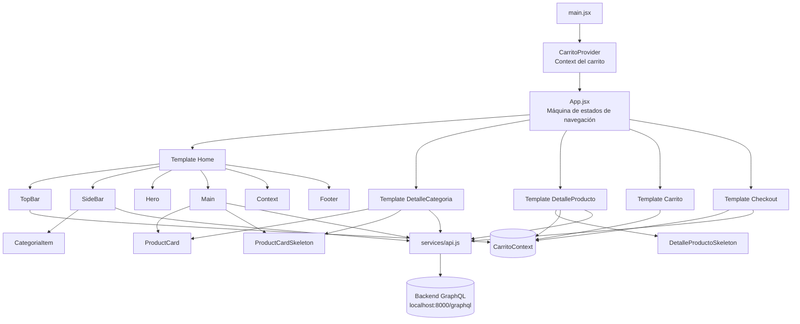
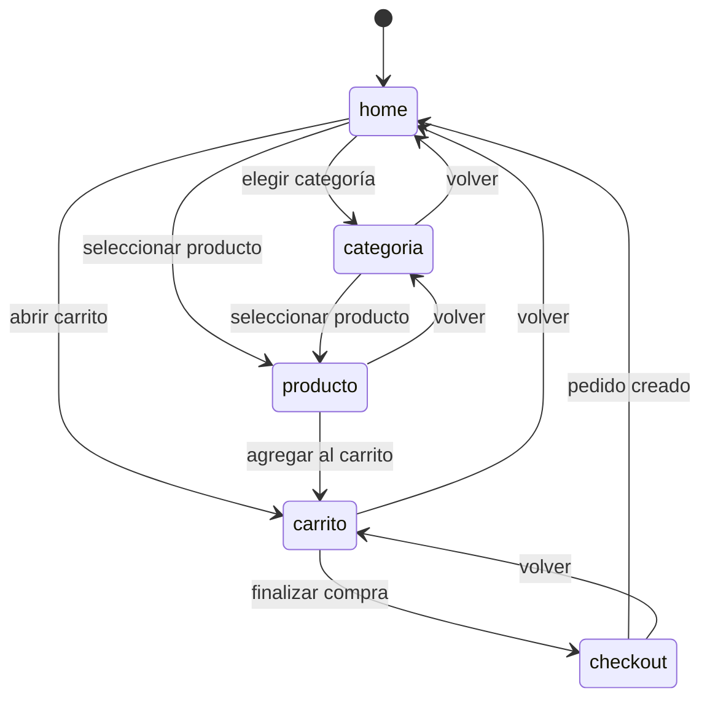

# Reporte de práctica — Programación Web 2

## Portada

| Campo | Dato |
|--|--|
| Darío Jiménez Guzmán | |
| Materia | Programación Web 2 |
| Práctica | P2 — Flujo E-Commerce Maquetado React |
| Fecha | 12/09/2026 |

## Marco teórico

### Componentes

En React, un componente es una pieza reutilizable de la interfaz. Se define como una función que retorna JSX y puede combinar otros componentes. En esta práctica se separó la aplicación en piezas como `TopBar`, `SideBar`, `Hero`, `Main`, `ProductCard` y `Footer`. Esta división permite que cada parte tenga una responsabilidad concreta y facilita modificar una sección sin afectar toda la aplicación.

También se utilizaron componentes de mayor nivel llamados templates: `Home`, `DetalleCategoria`, `DetalleProducto`, `Carrito` y `Checkout`. Una template organiza varios componentes para representar una pantalla completa del flujo de compra.

### Props

Las props son datos y funciones que un componente recibe desde su componente padre. Son de solo lectura para el componente que las recibe. Por ejemplo, `Home` recibe `onElegirCategoria`, `onVerProducto` y `onIrACarrito`; después entrega esas funciones a `SideBar`, `Main` y `TopBar`.

Las props permiten que los componentes sean reutilizables y que la lógica de navegación permanezca centralizada en `App`. De esta forma, una tarjeta de producto no necesita conocer cómo cambia la pantalla: solo ejecuta la función `onClick` que recibió.

### Estado

El estado representa información que puede cambiar durante la ejecución y que debe provocar una nueva renderización. La aplicación utiliza `useState` para almacenar la pantalla actual, los identificadores de categoría y producto, los productos cargados, las cantidades y los estados de carga o error.

Por ejemplo, `App` mantiene el estado `pantalla`, mientras `DetalleProducto` mantiene `cantidad`. Cuando el usuario cambia una cantidad o selecciona una categoría, React actualiza el estado y vuelve a renderizar la interfaz con la información nueva.

### Eventos

Los eventos son acciones del usuario o del navegador que ejecutan funciones. En JSX se manejan con propiedades como `onClick`, `onChange` y `onSubmit`. En este proyecto, un clic en una categoría cambia la pantalla a `categoria`, un clic en una tarjeta abre el producto y el cambio de un input modifica la cantidad.

Los eventos se propagan mediante callbacks recibidos por props. Este patrón evita que los componentes visuales tengan que conocer directamente toda la lógica de la aplicación.

### Máquina de estados

La navegación principal se modeló como una máquina de estados sencilla. La variable `pantalla` puede tener los estados `home`, `categoria`, `producto`, `carrito` y `checkout`. Cada interacción produce una transición:

- `home` -> `categoria` al elegir una categoría.
- `home` o `categoria` -> `producto` al seleccionar un producto.
- `producto` -> `carrito` al agregar un producto.
- `carrito` -> `checkout` al finalizar la compra.
- `checkout` -> `home` cuando el pedido se crea correctamente.

Este enfoque hace explícitas las pantallas posibles y evita renderizar todas al mismo tiempo. `App` funciona como controlador de la máquina porque decide qué template mostrar según el valor de `pantalla`.

### Context y Zustand

Para compartir el carrito entre distintas pantallas se utilizó React Context. `CarritoProvider` envuelve la aplicación y expone `items`, `total`, `agregarAlCarrito`, `quitarDelCarrito`, `cambiarCantidad` y `vaciarCarrito`. Cualquier componente descendiente puede acceder a esos datos mediante `useCarrito`, sin tener que recibirlos por muchas capas de props.

Zustand es una alternativa para resolver el mismo problema mediante un store global basado en hooks. En este proyecto no se utilizó Zustand porque el estado compartido es pequeño y Context resulta suficiente. Si el e-commerce creciera y tuviera muchos dominios globales, como usuario, favoritos, filtros, pedidos y notificaciones, un store de Zustand podría reducir el código de providers y centralizar mejor las acciones.

### Diseño atómico

El diseño atómico organiza la interfaz desde piezas pequeñas hasta pantallas completas:

- **Átomos:** botones, inputs, imágenes, textos y elementos `Skeleton`.
- **Moléculas:** `ProductCard`, `CategoriaItem` y controles de cantidad.
- **Organismos:** `TopBar`, `SideBar`, `Main` y las listas de productos.
- **Templates:** `Home`, `DetalleCategoria`, `DetalleProducto`, `Carrito` y `Checkout`.

Esta organización ayuda a reutilizar estilos y comportamiento. Por ejemplo, `ProductCard` se utiliza tanto en el catálogo principal como en el detalle de una categoría. La separación también permite agregar estados de carga mediante `ProductCardSkeleton` y `DetalleProductoSkeleton` sin duplicar la estructura completa de las pantallas.

## Diseño / planeación

### Diagrama de componentes

El siguiente diagrama representa la arquitectura principal construida. `App` controla la navegación entre templates, `CarritoProvider` comparte el estado del carrito y `api.js` comunica las pantallas con el backend GraphQL.

El flujo de datos es descendente: `App` envía callbacks a las templates y estas los entregan a sus componentes hijos mediante props. El estado del carrito se comparte de forma transversal mediante Context. Las consultas de categorías, productos y pedidos pasan por el servicio `fetchGraphQL`, que centraliza la comunicación con el backend.

### Transiciones de navegación

La máquina de estados separa la navegación de la presentación. Cada template se enfoca en mostrar información y emitir eventos, mientras `App` decide cuál será la siguiente pantalla.

## Conclusión

- **¿Qué aprendiste?:**  
Varias cosas de React no me habían quedado lo suficientemente claras desde la práctica 1, pero sobre todo los Skeletons y el uso de hooks fue lo que pude mejorar bastante durante el desarrollo de esta práctica.

- **¿Qué dificultades encontraste y cómo las resolviste?:**  
Tuve poco tiempo, se me juntaron varios trabajos, y el día que iba a tomarme el trabajo para hacerlo, me pidieron hacer inventario :'v.

- **¿Cómo aplicarás lo aprendido a tu PF (e-commerce)?:**
Este es basicamente el E-Commerce en esencia, un diseño inicial.
